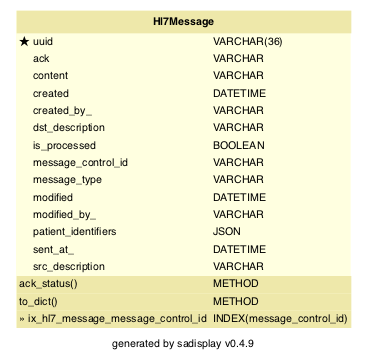

<!-- Title - A concise title for the service that fits the pattern identified and in use across all services. -->
# Polaris Connector API

[](https://github.com/ambv/black)

<!-- Description - Fewer than 500 words that describe what a service delivers, providing an informative, descriptive, and comprehensive overview of the value a service brings to the table. -->
The Connector API is part of the Polaris platform (formerly DHOS). This service is responsible for integration between
Polaris and hospital EPRs via HL7.

## Maintainers
The Polaris platform was created by Sensyne Health Ltd., and has now been made open-source. As a result, some of the
instructions, setup and configuration will no longer be relevant to third party contributors. For example, some of
the libraries used may not be publicly available, or docker images may not be accessible externally. In addition, 
CICD pipelines may no longer function.

For now, Sensyne Health Ltd. and its employees are the maintainers of this repository.

## Setup
These setup instructions assume you are using out-of-the-box installations of:
- `pre-commit` (https://pre-commit.com/)
- `pyenv` (https://github.com/pyenv/pyenv)
- `poetry` (https://python-poetry.org/)

You can run the following commands locally:
```bash
make install  # Creates a virtual environment using pyenv and installs the dependencies using poetry
make lint  # Runs linting/quality tools including black, isort and mypy
make test  # Runs unit tests
```

You can also run the service locally using the script `run_local.sh`, or in dockerized form by running:
```bash
docker build . -t <tag>
docker run <tag>
```

## Documentation
<!-- Include links to any external documentation including relevant ADR documents.
     Insert API endpoints using markdown-swagger tags (and ensure the `make openapi` target keeps them up to date).
     -->

<!-- markdown-swagger -->
 Endpoint                                       | Method | Auth? | Description                                                                                                                                              
 ---------------------------------------------- | ------ | ----- | ---------------------------------------------------------------------------------------------------------------------------------------------------------
 `/running`                                     | GET    | No    | Verifies that the service is running. Used for monitoring in kubernetes.                                                                                 
 `/version`                                     | GET    | No    | Get the version number, circleci build number, and git hash.                                                                                             
 `/dhos/v1/message`                             | POST   | Yes   | Submit a new HL7 message to the platform. The message will be processed asynchronously, but ACKed synchronously.                                         
 `/dhos/v1/message/{message_uuid}`              | PATCH  | Yes   | Marks an existing message as processed                                                                                                                   
 `/dhos/v1/message/{message_uuid}`              | GET    | Yes   | Returns a single message with the specified UUID or error 404 if there is no such message                                                                
 `/dhos/v1/oru_message`                         | POST   | Yes   | Generates an ORU message based on the provided data                                                                                                      
 `/dhos/v1/message/search/{message_control_id}` | GET    | Yes   | Returns a list of messages with the specified message control id. If there are no matching messages the call is successful and the list is empty.        
 `/dhos/v1/message/search`                      | GET    | Yes   | Returns a list of messages with the specified identifier. If there are no matching messages the call is successful and the list is empty.                
 `/dhos/v1/cda_message`                         | POST   | Yes   | Creates a CDA message and attempts to forward it to the Trust. If forwarding fails the message is posted to the failed request queue to be retried later.
<!-- /markdown-swagger -->

## Requirements
<!-- An outline of what other services, tooling, and libraries needed to make a service operate, providing a
  complete list of EVERYTHING required to work properly. -->
  At a minimum you require a system with Python 3.9. Tox 3.20 is required to run the unit tests, docker with docker-compose are required to run integration tests. See [Development environment setup](https://sensynehealth.atlassian.net/wiki/spaces/SPEN/pages/3193270/Development%2Benvironment%2Bsetup) for a more detailed list of tools that should be installed.
  
## Deployment
<!-- Setup - A step by step outline from start to finish of what is needed to setup and operate a service, providing as
  much detail as you possibly for any new user to be able to get up and running with a service. -->
  
  All development is done on a branch tagged with the relevant ticket identifier.
  Code may not be merged into develop unless it passes all CircleCI tests.
  :partly_sunny: After merging to develop tests will run again and if successful the code is built in a docker container and uploaded to our Azure container registry. It is then deployed to test environments controlled by Kubernetes.

## Testing
<!-- Testing - Providing details and instructions for mocking, monitoring, and testing a service, including any services or
  tools used, as well as links or reports that are part of active testing for a service. -->

### Unit tests
:microscope: Either use `make` or run `tox` directly.

<!-- markdown-make Makefile tox.ini -->
`tox` : Running `make test` or tox with no arguments runs `tox -e lint,default`

`make clean` : Remove tox and pyenv virtual environments.

`tox -e debug` : Runs last failed unit tests only with debugger invoked on failure. Additional py.test command line arguments may given preceded by `--`, e.g. `tox -e debug -- -k sometestname -vv`

`make default` (or `tox -e default`) : Installs all dependencies, verifies that lint tools would not change the code, runs security check programs then runs unit tests with coverage. Running `tox -e py39` does the same but without starting a database container.

`tox -e flask` : Runs flask within the tox environment. Pass arguments after `--`. e.g. `tox -e flask -- --help` for a list of commands. Use this to create database migrations.

`make help` : Show this help.

`make lint` (or `tox -e lint`) : Run `black`, `isort`, and `mypy` to clean up source files.

`make openapi` (or `tox -e openapi`) : Recreate API specification (openapi.yaml) from Flask blueprint

`make pyenv` : Create pyenv and install required packages (optional).

`make readme` (or `tox -e readme`) : Updates the README file with database diagram and commands. (Requires graphviz `dot` is installed)

`make test` : Test using `tox`

`make update` (or `tox -e update`) : Updates the `poetry.lock` file from `pyproject.toml`

<!-- /markdown-make -->

## Integration tests
:nut_and_bolt: Integration tests are located in the `integration-tests` sub-directory. After changing into this directory you can run the following commands:

<!-- markdown-make integration-tests/Makefile -->
<!-- /markdown-make -->

## Issue tracker
:bug: Bugs related to this microservice should be raised on Jira as [PLAT-###](https://sensynehealth.atlassian.net/issues/?jql=project%20%3D%20PLAT%20AND%20component%20%3D%20Locations) tickets with the component set to Locations.

## Database migrations
Any changes affecting the database schema should be reflected in a database migration. Simple migrations may be created automatically:

```$ tox -e flask -- db migrate -m "some description"```

More complex migration may be handled by creating a migration file as above and editing it by hand.
Don't forget to include the reverse migration to downgrade a database.
  
## Configuration
<!-- Configuration - An outline of all configuration and environmental variables that can be adjusted or customized as part
  of service operations, including as much detail on default values, or options that would produce different known
  results for a service. -->
  * `DATABASE_USER, DATABASE_PASSWORD,
   DATABASE_NAME, DATABASE_HOST, DATABASE_PORT` configure the database connection.
  * `LOG_LEVEL=ERROR|WARN|INFO|DEBUG` sets the log level
  * `LOG_FORMAT=colour|plain|json` configure logging format. JSON is used for the running system but the others may be more useful during development.
  
## Database
HL7 messages are stored in a Postgres database.

<!-- Rebuild this diagram with `make readme` -->


## Incoming HL7 messages

The hospital EPR is the source of truth for some of the information within Polaris. When we receive HL7 messages, specifically ADT (admit, discharge, transfer) messages, we update this information in Polaris.

ADT messages can result in updates to:
- Patients
- Encounters (hospital stays)
- Locations
- Observations

HL7 messages are parsed to an internal format, so that our other services can be HL7 agnostic. Messages are then published to RabbitMQ, with the body in the internal format. This looks something like:
```json
{
    "dhos_connector_message_uuid": "some_uuid",
    "actions": [
        {
            "name": "process_patient",
            "data": {
                "first_name": "STEPHEN",
                "last_name": "ZZZASSESSMENTS",
                "sex_sct": "248153007",
                "mrn": "90462826",
                "date_of_birth": "1982-11-03"
            }
        },
        {
            "name": "process_location",
            "data": {
                "location": {
                    "epr_ward_code": "J-WD 5A",
                    "epr_bay_code": "Room 01",
                    "epr_bed_code": "Bed A"
                },
                "previous_location": {
                    "epr_ward_code": "J-WD WWRecovery",
                    "epr_bay_code": "In Theatre",
                    "epr_bed_code": "Bed 01"
                }
            }
        },
        {
            "name": "process_encounter",
            "data": {
                "epr_encounter_id": "907665208",
                "location": {
                    "epr_ward_code": "J-WD 5A",
                    "epr_bay_code": "Room 01",
                    "epr_bed_code": "Bed A"
                },
                "encounter_type": "INPATIENT",
                "admitted_at": "2017-02-01T14:27:00.000Z",
                "admission_cancelled": false,
                "transfer_cancelled": false,
                "discharge_cancelled": false,
                "encounter_moved": false,
                "patient_deceased": false,
                "previous_location": {
                    "epr_ward_code": "J-WD WWRecovery",
                    "epr_bay_code": "In Theatre",
                    "epr_bed_code": "Bed 01"
                }
            }
        }
    ]
}
```

We respond to HL7 messages with a 200 status code and an ACK message in base64 encoded HL7 format.

## Outgoing messages

When observations are taken in Polaris, we send ORU (observation result) messages to the hospital EPR via HTTP.

Data is posted in the following form:

```json
{
        "actions": [
            {
                "data": {
                    "clinician": { ... },
                    "encounter": { ... },
                    "observation_set": { ... },
                    "patient": { ... },
                "name": "process_observation_set",
            }
        ]
    }
```

This data is used to generate an ORU message, which is then base64 encoded and POSTed to the EPR Service Adapter.
